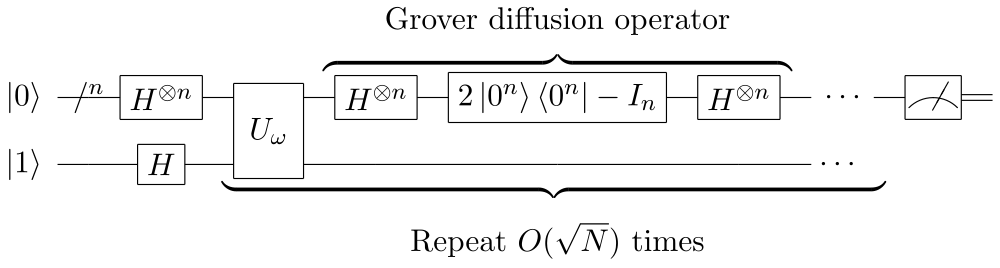
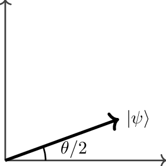
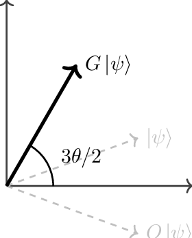

# QuantumSearch: Grover’s Algorithm in C++

[📘 Getting Started](GETTING_STARTED.md) • [📄 License](LICENSE)



A header-only C++ library simulating Grover’s quantum search algorithm, offering an easy-to-use interface for educational and benchmarking purposes.

---

## Table of Contents

- [Algorithm Overview](#algorithm-overview)
- [Implementation Details](#implementation-details)
- [Performance Comparison](#performance-comparison)
- [Quantum vs Classical Architectures](#quantum-vs-classical-architectures)
- [Getting Started](#getting-started)
- [License](#license)

---

## Algorithm Overview

Grover’s algorithm finds a marked item in an unstructured database of size N = 2^n in O(sqrt(N)) steps, offering a quadratic speedup over classical O(N) search.

1. **Initialization**: Prepare an equal superposition of all N basis states.
   
   

2. **Oracle Query**: Flip the phase of the target state |t>:
   U_f: |x> → (-1)^{f(x)} |x>, where f(x)=1 if x=t, else 0.

3. **Diffusion (Inversion about the Mean)**: Reflect all amplitudes about their average to amplify the target.
   
   

4. **Iteration**: Repeat Oracle + Diffusion floor(pi/4 * sqrt(N)) times.

5. **Measurement**: Observe the final state to retrieve the target index with high probability.

---

## Implementation Details

The `QuantumSearch` class (in **src/QuantumSearch.h** / **src/QuantumSearch.cpp**) provides:

- A complex state vector of size 2^n
- `initialize()`, `applyOracle()`, `applyDiffusion()`, `run()`, `measure()` methods

Example usage:

```cpp
#include "QuantumSearch.h"

int main() {
    quantum::QuantumSearch qs(3, 5); // 3 qubits, target index 5
    qs.run();
    auto result = qs.measure();
    std::cout << "Measured index: " << result << std::endl;
}
```

### `grover_search` Helper

A template function for any numeric container:

```cpp
int idx = quantum::grover_search(my_vector, key_value, 100);
```

- Returns >=0: index found
- Returns -1: element not found
- Returns -2: unreliable result

---

## Performance Comparison

Compare classical vs. Grover simulation:

```cpp
auto start = now();
std::find(data.begin(), data.end(), target);
auto end = now();
print("std::find time=", duration(start,end));

start = now();
quantum::grover_search(data, target, 50);
end = now();
print("Grover time=", duration(start,end));
```

| Method            | Theoretical | Simulation Cost       |
|-------------------|-------------|-----------------------|
| std::find         | O(N)        | O(N)                  |
| Grover’s (ideal)  | O(sqrt(N))  | O(sqrt(N) * 2^n)      |

> Note: Classical simulation overhead makes Grover’s slower than std::find.

---

## Quantum vs Classical Architectures

- **Classical CPU**: Bits, O(N) memory and time
- **Quantum Processor**: Qubits, superposition enables O(sqrt(N)) queries

| Feature         | Classical       | Quantum              |
|-----------------|-----------------|----------------------|
| Data            | Bits            | Qubits               |
| Parallelism     | Multi-core/SIMD | Intrinsic via superposition |
| Memory          | O(N)            | Physical qubits for n      |
| Query Complexity| O(N)            | O(sqrt(N))             |

---

## Getting Started

For detailed instructions on cloning, building, and running, see [Getting Started](GETTING_STARTED.md).

---

## License

This project is licensed under the MIT License. See [License](LICENSE) for details.

