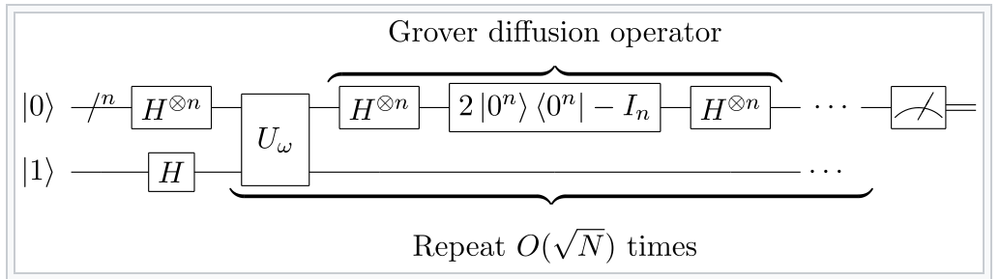

# 🚀 QuantumSearch: Grover’s Algorithm in C++

[📘 Getting Started](GETTING_STARTED.md) • [📄 License](LICENSE)



A header-only C++ library simulating Grover’s quantum search algorithm, offering an easy-to-use interface for educational and benchmarking purposes.

---

## 🧭 Table of Contents

- [📖 Algorithm Overview](#-algorithm-overview)
- [🔧 Implementation Details](#-implementation-details)
- [⏱️ Performance Comparison](#-performance-comparison)
- [🧠 Quantum vs Classical Architectures](#-quantum-vs-classical-architectures)
- [🚀 Getting Started](#-getting-started)
- [📄 License](#-license)

---

## 📖 Algorithm Overview

Grover’s algorithm finds a marked item in an unstructured database of size N = $`2^n`$ in O($`\sqrt{N}`$) steps, offering a quadratic speedup over classical O(N) search.

1. **✨ Initialization**: Prepare an equal superposition of all N basis states.
   
   

2. **🎯 Oracle Query**: Flip the phase of the target state $`|t\rangle`$:  
$`U_f: |x\rangle \rightarrow (-1)^{f(x)} |x\rangle`$,  
where $`f(x) = 1`$ if $`x = t`$, else 0.

3. **🔄 Diffusion (Inversion about the Mean)**: Reflect all amplitudes about their average to amplify the target.
   
   

4. **🔁 Iteration**: Repeat Oracle + Diffusion floor($`0.25\pi\sqrt{N}`$) times.

5. **📏 Measurement**: Observe the final state to retrieve the target index with high probability.

---

## 🔧 Implementation Details

The `QuantumSearch` class (in **src/QuantumSearch.h** / **src/QuantumSearch.cpp**) provides:

- A complex state vector of size $`2^n`$
- `initialize()`, `applyOracle()`, `applyDiffusion()`, `run()`, `measure()` methods

💡 **Example usage**:

```cpp
#include "QuantumSearch.h"

int main() {
    quantum::QuantumSearch qs(3, 5); // 3 qubits, target index 5
    qs.run();
    auto result = qs.measure();
    std::cout << "Measured index: " << result << std::endl;
}
```

### 🧩 `grover_search` Helper

A template function for any numeric container:

```cpp
int idx = quantum::grover_search(my_vector, key_value, 100);
```

- Returns ≥0: index found  
- Returns -1: element not found  
- Returns -2: unreliable result  

---

## ⏱️ Performance Comparison

Compare classical vs. Grover simulation:

```cpp
auto start = now();
std::find(data.begin(), data.end(), target);
auto end = now();
print("std::find time=", duration(start,end));

start = now();
quantum::grover_search(data, target, 50);
end = now();
print("Grover time=", duration(start,end));
```

| Method            | Theoretical         | Simulation Cost            |
|-------------------|---------------------|-----------------------------|
| `std::find`       | O(N)                | O(N)                        |
| Grover’s (ideal)  | O($`\sqrt{N}`$)     | O($`\sqrt{N} * 2^n`$)       |

> ⚠️ **Note:** Classical simulation overhead makes Grover’s slower than std::find.

---

## 🧠 Quantum vs Classical Architectures

- **🖥️ Classical CPU**: Bits, O(N) memory and time  
- **⚛️ Quantum Processor**: Qubits, superposition enables O($`\sqrt{N}`$) queries

| Feature            | Classical             | Quantum                      |
|--------------------|-----------------------|-------------------------------|
| Data               | Bits                  | Qubits                        |
| Parallelism        | Multi-core / SIMD     | Intrinsic via superposition   |
| Memory             | O(N)                  | Physical qubits for $`n`$     |
| Query Complexity   | O(N)                  | O($`\sqrt{N}`$)               |

---

## 🚀 Getting Started

For detailed instructions on cloning, building, and running, see [Getting Started](GETTING_STARTED.md).

---

## 📄 License

This project is licensed under the MIT License. See [License](LICENSE) for details.
